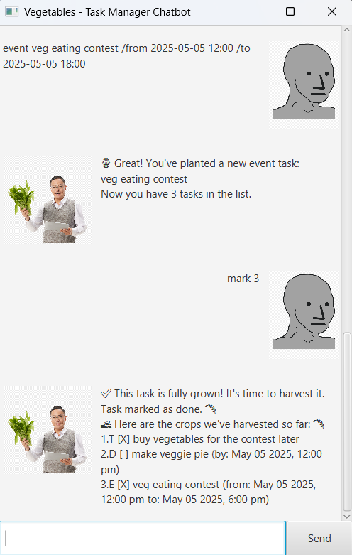

# **Vegetables - User Guide**  
*Your personal task manager chatbot!*  



## **Introduction**  
Vegetables is a smart chatbot designed to help you manage your tasks efficiently. It supports **To-Dos, Deadlines, and Events**, allowing you to add, list, find, and delete tasks easily.  

## **Quick Start**  
1. Ensure you have **Java 11** or later installed.  
2. Download `vegetables.jar`.  
3. Open a terminal or command prompt and run:  
4. Start managing your tasks!  

## **Features**  

### 📌 **1. Add a Task**  
You can add three types of tasks:  
- **To-Do**:
```todo <task description>```
Example:
```todo Buy groceries```

- **Deadline**:
```deadline <task description> /by YYYY-MM-DD HH:mm```
Example:
```deadline Submit report /by 2025-12-12 18:00```
 
- **Event**:  
```event <event description> /from YYYY-MM-DD HH:mm /to YYYY-MM-DD HH:mm```
Example:
```event Project meeting /from 2025-12-12 14:00 /to 2025-12-12 16:00```

---

### ✅ **2. Mark & Unmark Tasks**  
- **Mark as done**:  
```mark <task number>```
Example:  
```mark 1```

- **Unmark as not done**:  
```unmark <task number>```
Example:  
```unmark 1```

---

### 🗑️ **3. Delete a Task**  
```delete <task number>```
Example:  
```delete 2```

---

### 🔍 **4. Find Tasks**  
Find tasks containing a specific keyword/substring:  
```find <keyword>```
Example:  
```find report```

---

### 📋 **5. View Task List**  
Displays all your tasks.
```list```

---

### ❓ **7. Help**  
Displays a list of commands:  
```help```

---

## **Command Summary**  

| Action         | Format Example |
|---------------|---------------|
| Add To-Do     | `todo Buy milk` |
| Add Deadline  | `deadline Submit report /by 2025-12-12 18:00` |
| Add Event     | `event Meeting /from 2025-12-12 14:00 /to 2025-12-12 16:00` |
| List Tasks    | `list` |
| Mark Task     | `mark 1` |
| Unmark Task   | `unmark 1` |
| Delete Task   | `delete 2` |
| Find Tasks    | `find report` |
| Help          | `help` |

---

